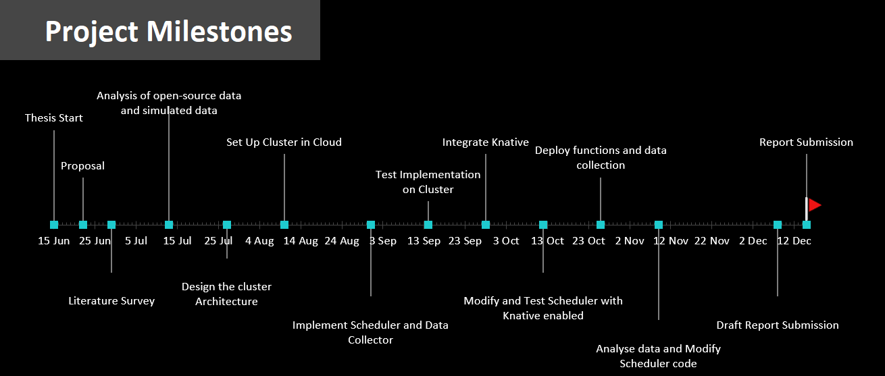

# Carbon-Aware Scheduler
Aim of this work will be to propose and develop a scheduling policy for intelligent placement of serverless workloads in different regions depending on the availability of renewable resources at given point of time. To achieve this, we will exploit  kubernetes’ container orchestration capabilities and Knative’s capability of building serverless applications.
## Thesis Milestone

# Meeting Agenda and Notes
## July 8, 2022
### Agenda
- Discussion on metrics sources - [WattTime](https://www.watttime.org/api-documentation/#introduction), [ElectricityMap](https://static.electricitymap.org/api/docs/index.html)  
  
### Notes
- Alternate scheduling schemes for comparision  

## July 21, 2022
### Agenda

- ElectricityMap data - [2021_Germany](https://drive.google.com/file/d/1F-PXu4p9sR28Gx2aJII-kuesCWV5vPS9/view?usp=sharing), [metrics](https://docs.google.com/spreadsheets/d/e/2PACX-1vQymR9eNK7U9bDSUBlyegx0y6FPhpe-mVBGniPzGtWDjZyHb8gI2NHSx-S49EXBhCkDe8dqfJAvsi3C/pubhtml#)
- Discussion on admiralty architecture - [link](https://admiralty.io/docs/concepts/topologies)
- Discussion on type of functions
- Metrics comparision - Latency, Carbon Efficiency
- Alternate Scheduling schemes - default, carbon-sched, geo-location sched
- Absolute Metrics? Carbon-efficient region vs deployment location

### Notes